# intune-patch-management-lab

Patch management is an important part within the lifecyle of a system since it shows compliance with standards, updates with the latest security features, and ensures against threats from attackers that might exploit previous vulnerabilites

# Setup
Windows 11 Enterprise LTSC 2024 Download: https://www.microsoft.com/en-us/evalcenter/download-windows-11-iot-enterprise-ltsc-eval   
Intune set up link: https://learn.microsoft.com/en-us/intune/fundamentals/free-trial-sign-up. Then go this link and set up the Intune environment do both P1 and P2:  
    
Then after setting up the trial you will get to the Microsoft 365 Admin Center here:    
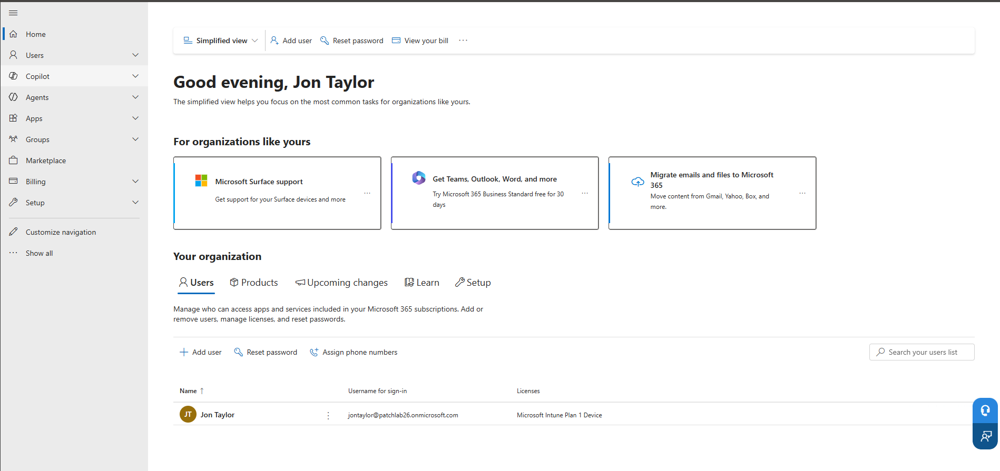  
Then click on show all to show all the admin centers and click on Microsoft Intune to get to the Intune center: 
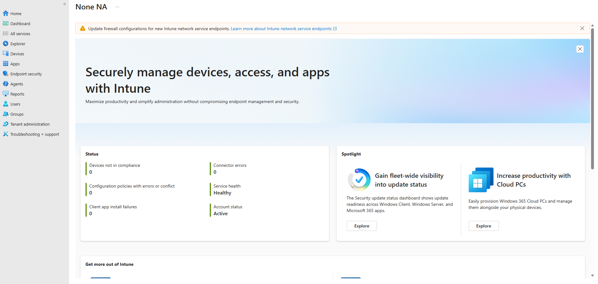    
Then create a user for patch management by going to users tab and click on new user and create the user and after creating the user, go to users in 365 and assign the Intune trial licenses to the test user after creation.   
Then go to Devices -> Enrollment to see this:   
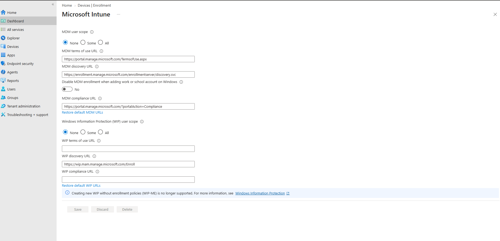       
Set MDM User scope to all and hit save
Then go create several security groups to be used here: 
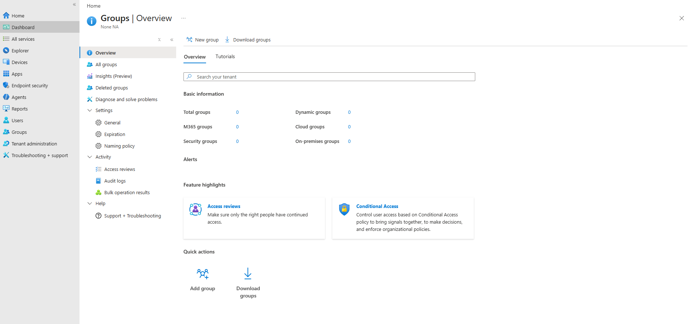    
Then click on add group to get here:    
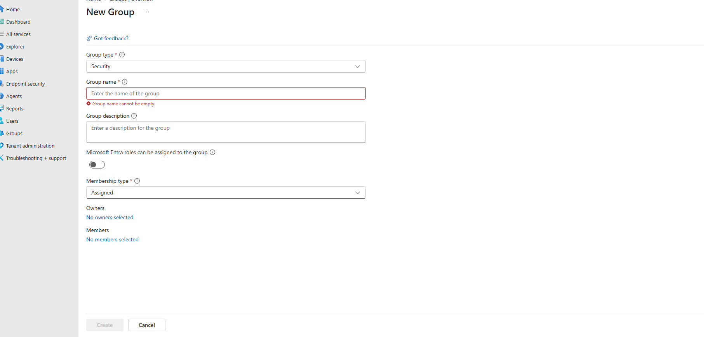  
Name groups Patch-Test, Patch-Pilot, and Pilot-Broad with membership type all set to assigned. After creating them, go to Devices -> Windows -> Manage Updates -> Windows updates and click on update rings:    
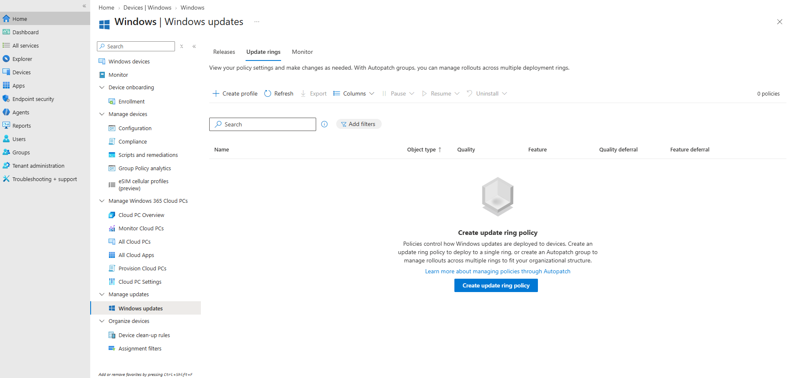  
Click on create profile and start creating the rings:   
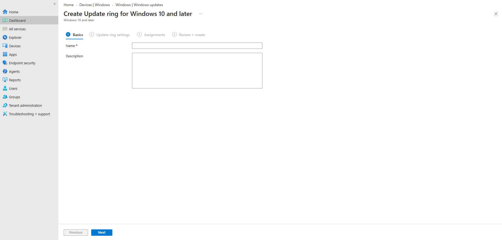  
Name the first ring as Ring Test with a description of Test ring with this configuration:   
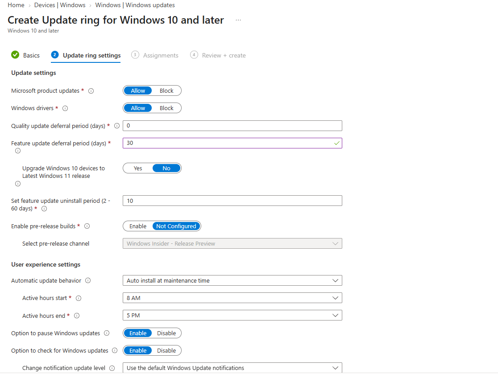    
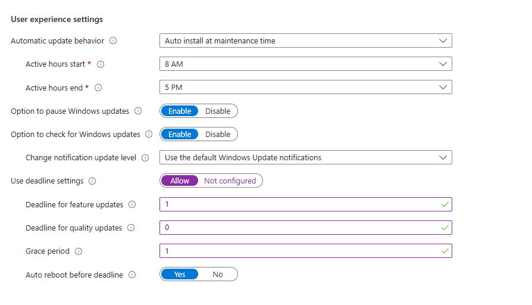    
Then click next and get to assignments and select the first group for them, Patch-Test, the hit create. After hitting create, create the other three groups.    
Patch-Pilot -> Ring-Pilot:  
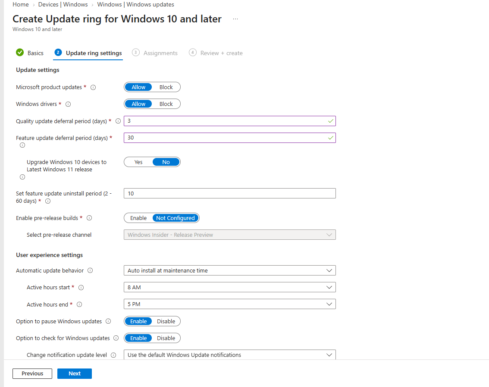    
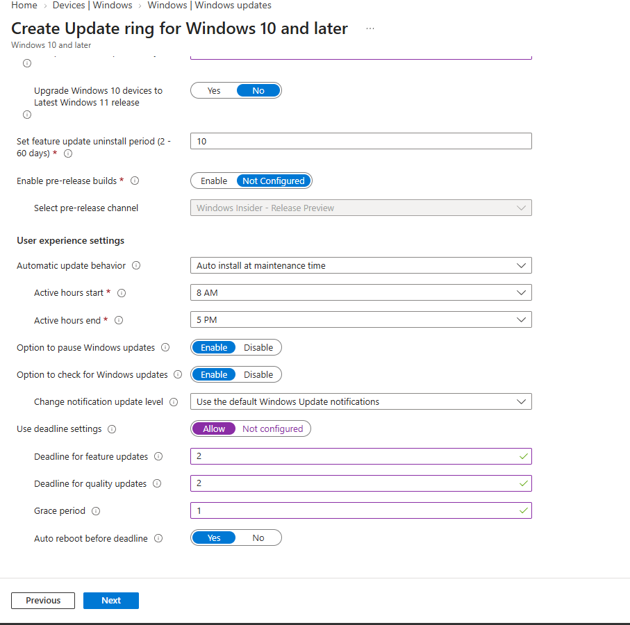  
Then have the group assignment be patch pilot.  
Patch-Broad -> Ring-Broad:  
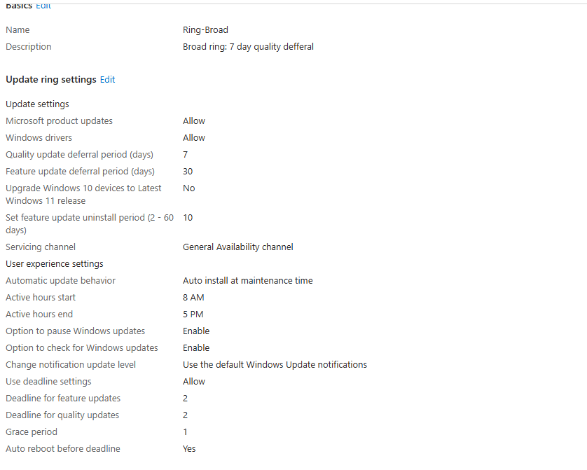  
And for Ring-Pilot updated: 
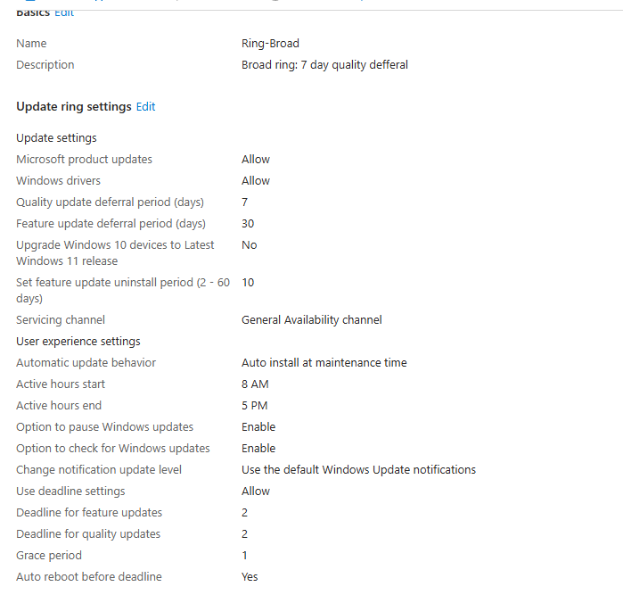   
And updated Test one:   
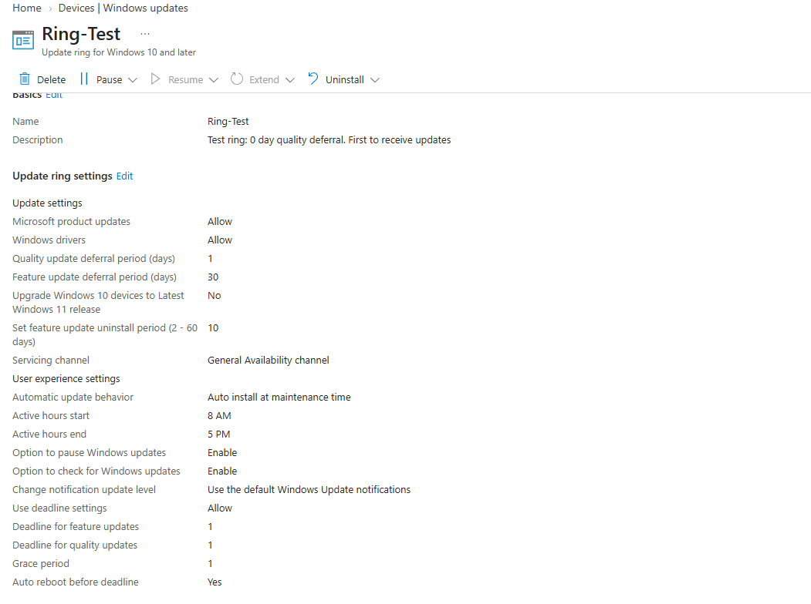    
After saving them, its time to move on to the VM part of it.    

# VMs
Create a network in host only networks with it set to 192.168.50.0/24 with DHCP enabled in NAT Networks and have it named PatchLab. 
Then lets go create the first VM:   
WIN-11-Test:    
