# intune-patch-management-lab

Patch management is an important part within the lifecyle of a system since it shows compliance with standards, updates with the latest security features, and ensures against threats from attackers that might exploit previous vulnerabilites

# Setup
Windows 11 Enterprise LTSC 2024 Download: https://www.microsoft.com/en-us/evalcenter/download-windows-11-iot-enterprise-ltsc-eval   
Intune set up link: https://learn.microsoft.com/en-us/intune/fundamentals/free-trial-sign-up. Then go this link and set up the Intune environment do both P1 and P2:  
    
Then after setting up the trial you will get to the Microsoft 365 Admin Center here:    
  
Then click on show all to show all the admin centers and click on Microsoft Intune to get to the Intune center: 
    
Then create a user for patch management by going to users tab and click on new user and create the user and after creating the user, go to users in 365 and assign the Intune trial licenses to the test user after creation.   
Then go to Devices -> Enrollment to see this:   
       
Set MDM User scope to all and hit save
Then go create several security groups to be used here: 
    
Then click on add group to get here:    
  
Name groups Patch-Test, Patch-Pilot, and Pilot-Broad with membership type all set to assigned. After creating them, go to Devices -> Windows -> Manage Updates -> Windows updates and click on update rings:    
  
Click on create profile and start creating the rings:   
  
Name the first ring as Ring Test with a description of Test ring with this configuration:   
    
    
Then click next and get to assignments and select the first group for them, Patch-Test, the hit create. After hitting create, create the other three groups.    
Patch-Pilot -> Ring-Pilot:  
    
  
Then have the group assignment be patch pilot.  
Patch-Broad -> Ring-Broad:  
  
And for Ring-Pilot updated: 
   
And updated Test one:   
    
After saving them, its time to move on to the VM part of it.    

# VMs
Create a network in host only networks with it set to 192.168.50.0/24 with DHCP enabled in NAT Networks and have it named PatchLab. 
Then lets go create the first VM:   
WIN-11-Test:    
128 MB of video memory    
4096 MB of of memory    
ICH9 chipset    
Adapter 1 set to PatchLab NAT Network with the virtual cable connected turned off, then start the VM to get it up and go through the setup process and click on install when you get to the screen and then wait a while for Windows 11 LSTC edition to install.    
After waiting a few:    
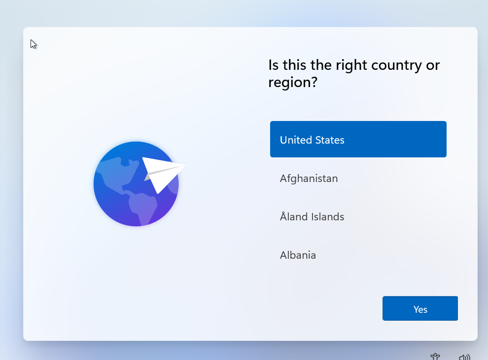    
Select US and hit next and keep on going till it gets to network:   
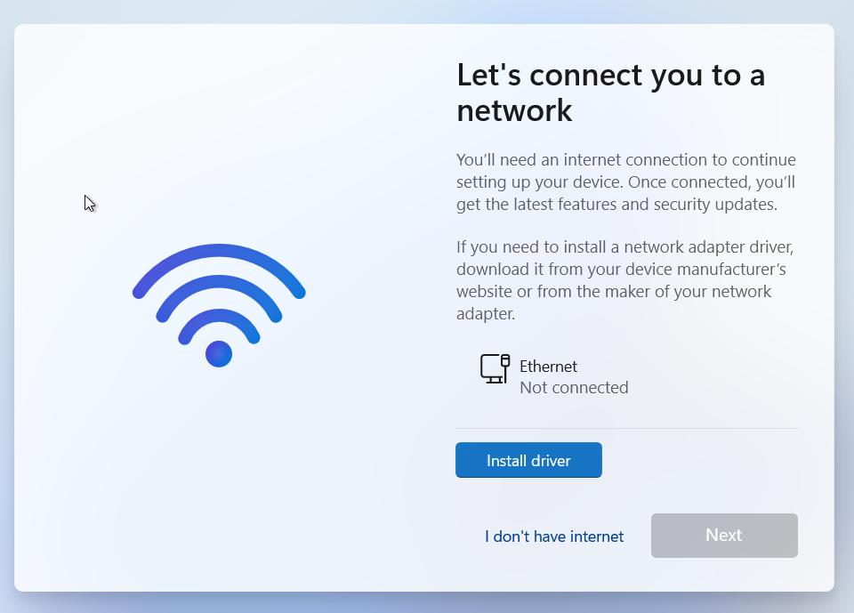  
Since the cable connected option was unticked, select the I don't have internet option. 
Then name the VM labadmin, set the password and security questions. Then turn off all privacy options and wait for setup.   
After getting to the desktop, go to Settings -> Systems -> About and click on rename the PC to WIN11-TEST and restart the VM.   
After restarting, type winver in the search to get the build of the VM iso: 
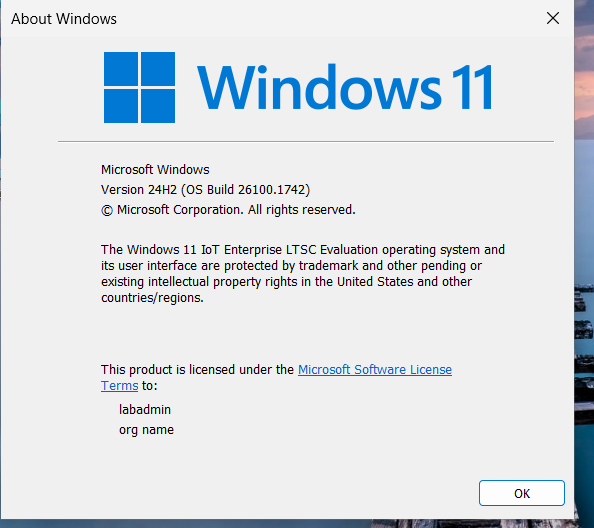    
Since its showing an older version, go to Update history in Settings -> Windows Update -> Update history to verify: 
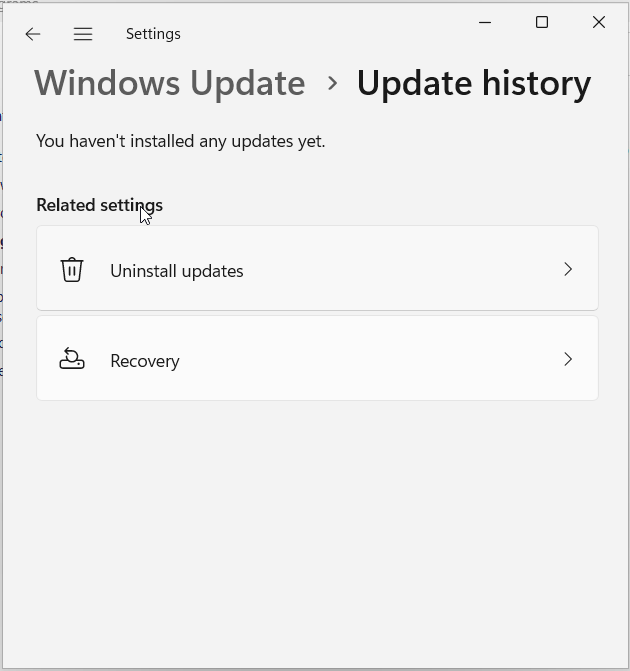    
And check Control panel by going to Program and Features and click on View installed updates:   
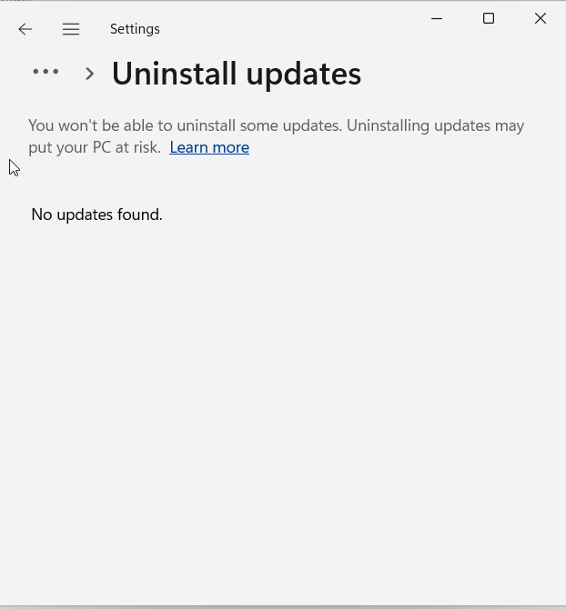    
After verifying, shut down the VM then click on Machine -> Tools -> Snapshot to get a snapshot of the VM by click on take and name it pre-join with a description:  
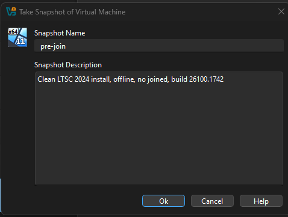    
Then right click on the VM to clone it and set it like this:    
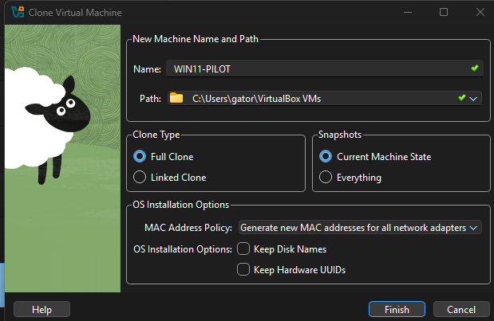  
Then hit finish and wait for it to appear after cloning and do the same thing for the third VM from cloning again.  
After cloning go into each one and rename the Windows machines inside.  
After changing their names, go into each VM configuration and select the cable connected option and in the VMs go to Settings -> Accounts -> Access work or school and click on the add a work or school account option to get enrolled into Entra ID.  
Make sure to also go into Windows Updates and pause them for a few weeks so they don't randomly update.   
Enter in the email for patch, change the password, set up MFA and a PIN and get signed in after restarting, then wait a few minutes to see it pop up in Intune in Devices -> Windows Devices:   
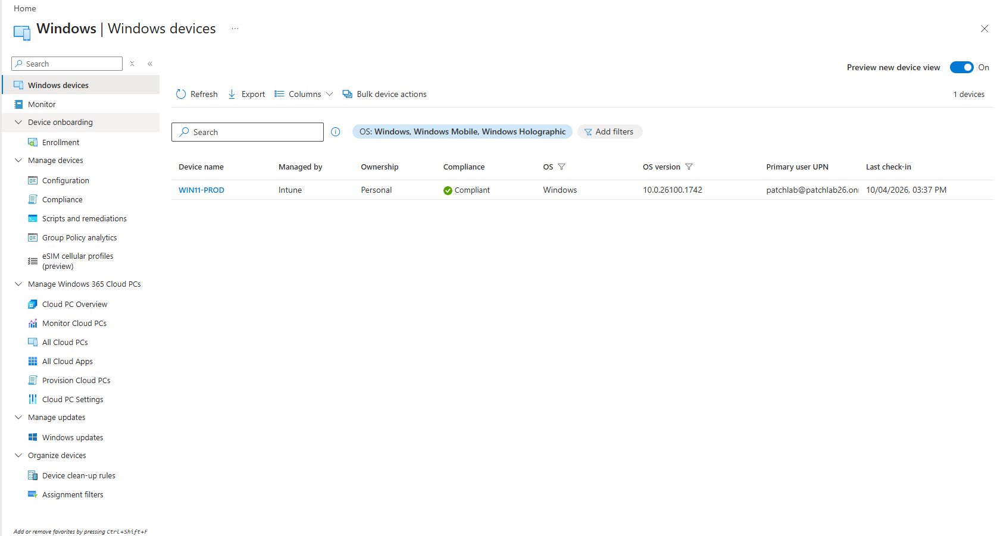    
With WIN11-PROD in there, do the same for the other VMs and create a snapshot called clean-unpatched for each.  
After getting them in, should show for each:    
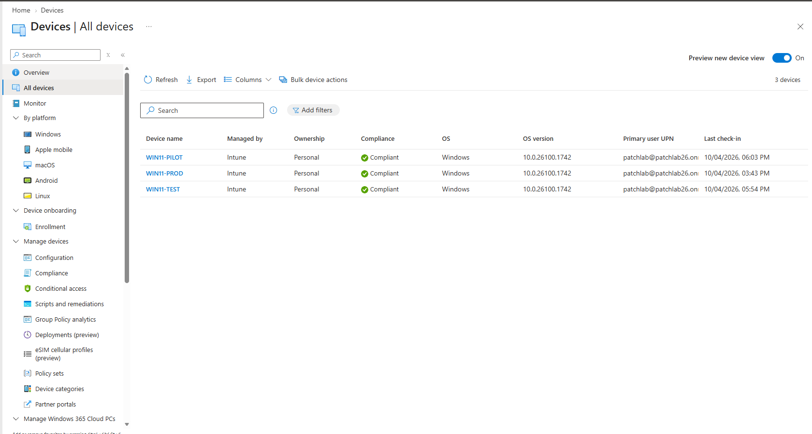  

# Patch Lifecycle
Now based off the above image, it shows the three devices with the same version for the baseline, same user, compliant with Intune and no dups. Something to also consider is making a snapshot of the three VMs known as clean-unpatched before moving forward.    
As part of the patch management lifecycle of the test phase of Identify -> Assess -> Prioritization -> Test -> Monitor/Deployment -> Verification -> Documentation. Start by adding WIN11-TESt to Patch-Test by clicking on Patch-Test -> Manage -> Members then click on Add Members:  
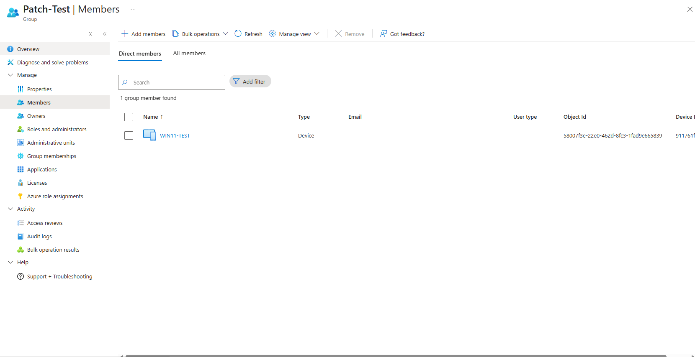  
Then turn on WIN11-TEST and sign in with the patchlab email and password and go to Settings -> Accounts -> Access work or school, click on manage and sign in and go back to Work or School after a few seconds to see the updated version: 
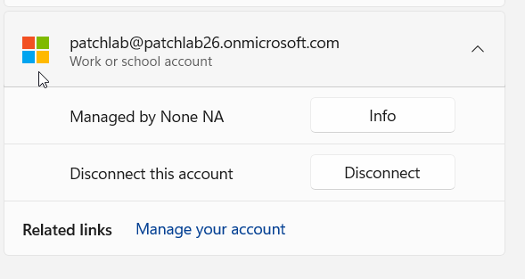 
Then click on info and scroll down to the sync option but it would be good checking dsregcmd /status to what it says:   
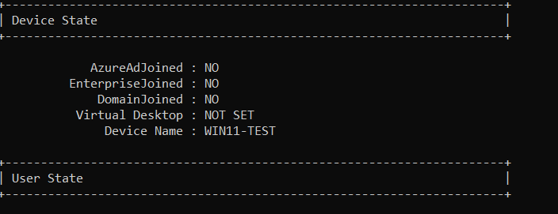  
So go delete from Intune and Entra and disconnect from the VM to get rid of it from the system, then after a few minutes, go back to Access work or school after clicking the alert notification, click disconnect, and click connect and instead choose the Join this device to Microsoft Entra ID instead and go through the process. Then go to signin and click on the three dots and click on switch user: 
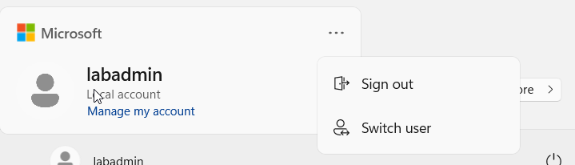    
Also check with dsregcmd /status to make sure it says Yes to AzureADJoined and AzureADPort after signing in with patchlab email: 
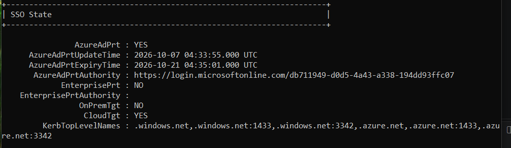    
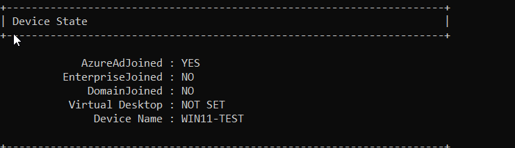    
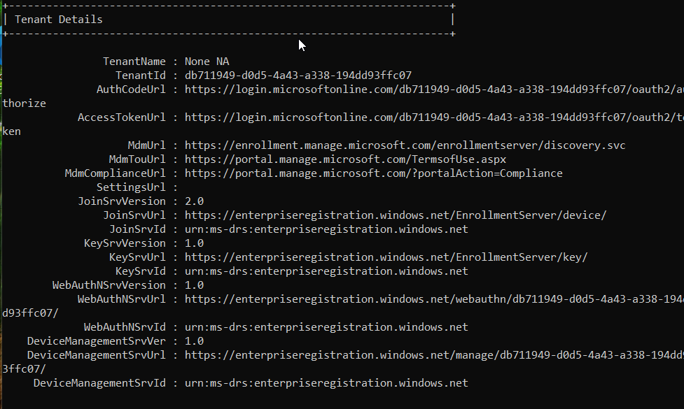    
For the third picture, MdmUrl needs to show a result, which this does.  
And on Intune:  
    
Do the same for the other two VMs too.  
Then go to Groups to Patch-Test and add WIN11-TEST to the group and boot it up. 
And this popped up: 
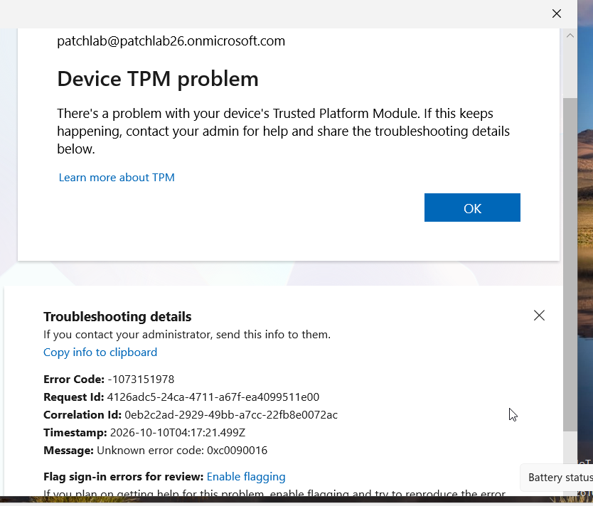  
Which pops up after clicking Sign in again to fix your work or school account from here:    
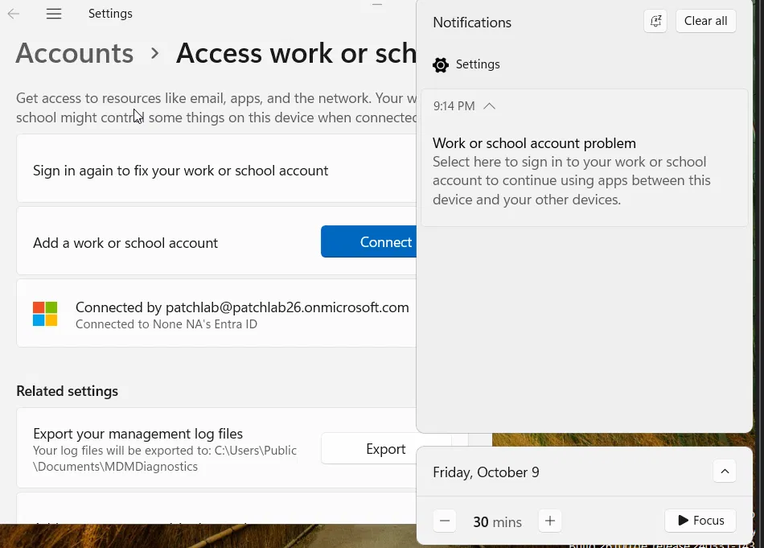   
Next would be shutting down the VM and going to the motherboard within settings and setting TPM to None.    
After signing back in disconnect from the domain using the labadmin account and delete from Entra ID and Intune. Then go back through the process by going to Access work or school and clicking on connect to go through the enroll in Entra process, restart and sign in again as patch lab and to make sure that TPM is off, run dsregcmd /status:   
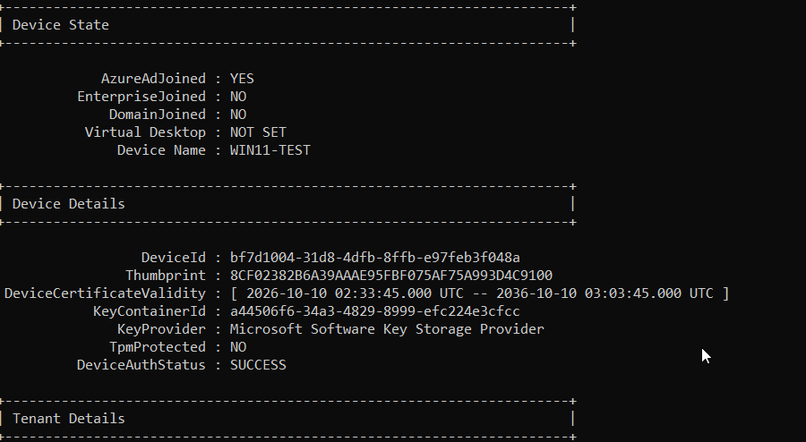  
Then do the same again for Prod and Pilot.  
After that process go and check Devices in the Intune admin center to see correct sync: 
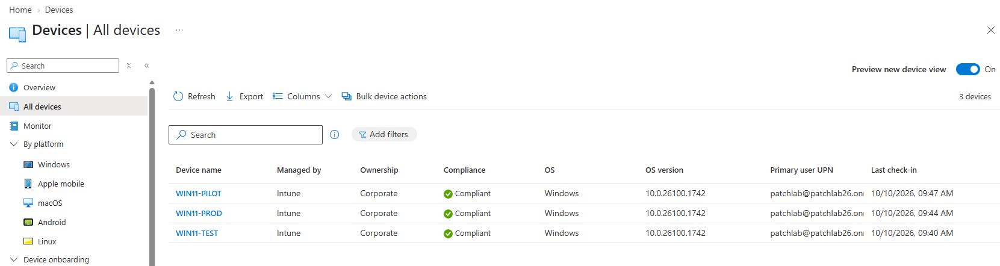    
Then its time to once again add WIN11-TEST to the Patch-Test group, and on WIN11-TEST go to Accounts -> Access work or school, click on the dropdown then Info and click on Sync:   
 
Then wait a bit and go to Ring-Test and check Windows Updates in Devices for Ring-Test and should show: 
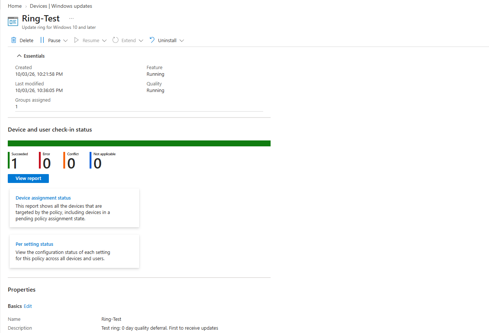  
Then click on view report and then click on device name:    
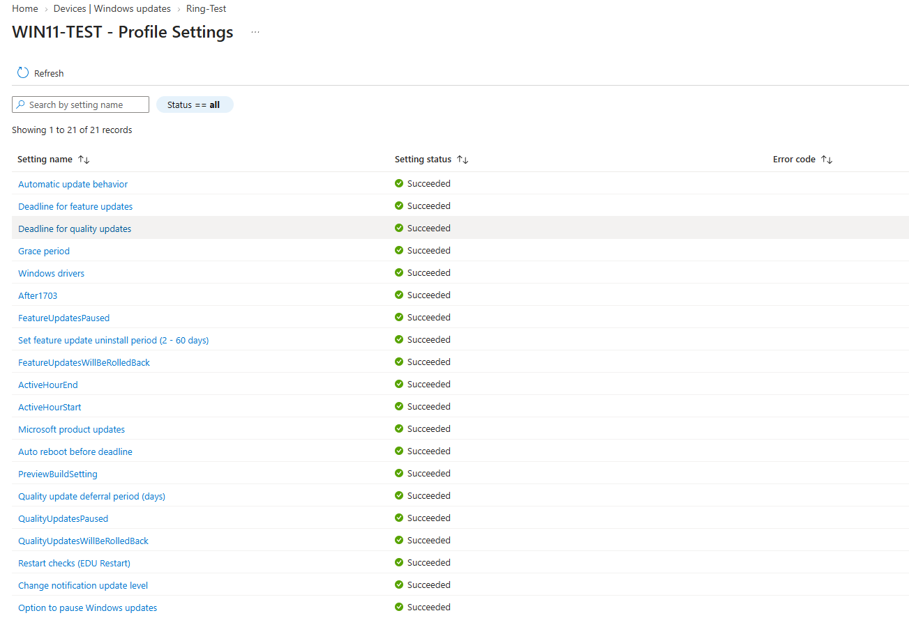    
On the Windows side go to Configured Policy updates and see the settings from Intune:   
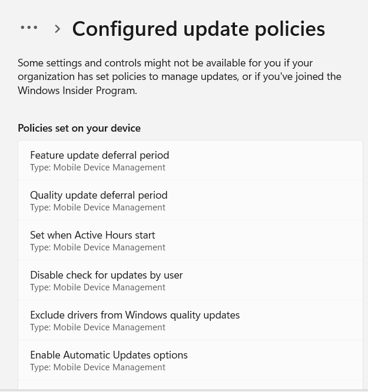    
Then go back to Windows update and click resume updates and wait for it to check for a few minutes: 
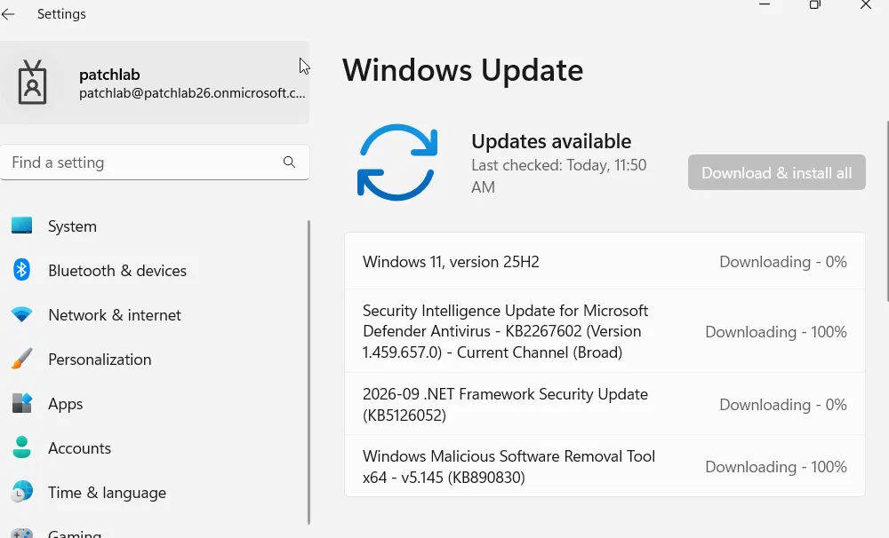 
And to prevent from updating to a newer OS version since this is patching run:  
$k = "HKLM:\SOFTWARE\Policies\Microsoft\Windows\WindowsUpdate"  
New-Item $k -Force | Out-Null   
Set-ItemProperty $k TargetReleaseVersion 1 -Type DWord  
Set-ItemProperty $k ProductVersion "Windows 11" -Type String    
Set-ItemProperty $k TargetReleaseVersionInfo "24H2" -Type String    
Restart-Service wuauserv    
And if the new OS stays up select pause updates and run the Restart-Service wuauserv command again and click on resume updates: 
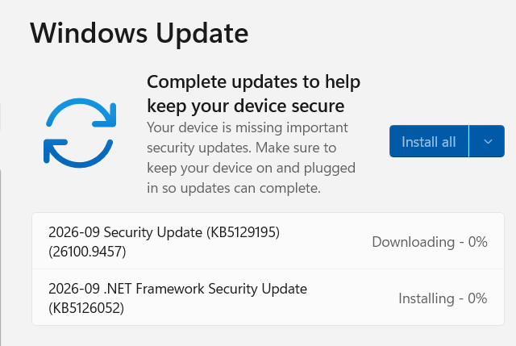  
Then wait for the updates to finish or get to a point to click on restart now.  
After waiting:  
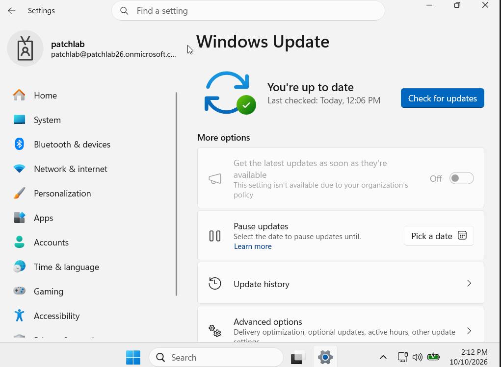  
And check winver to see the version:    
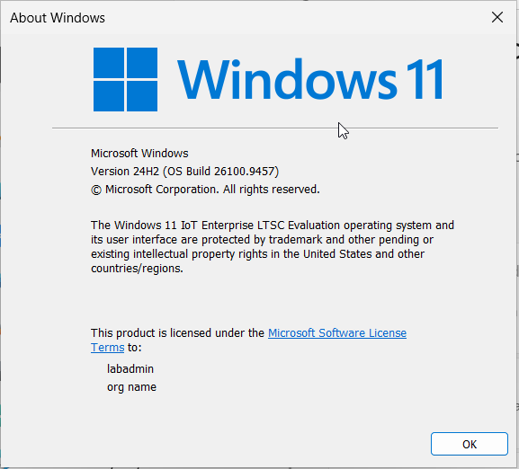  
And updates history:    
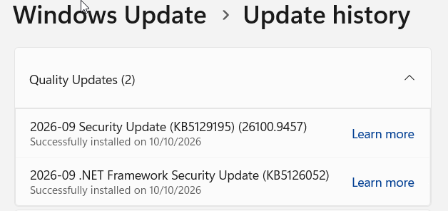    
Since its up to date and the winver version is newer, pause updates for now while also checking in Event Viewer -> Application and Services -> Microsoft -> Windows -> WindowsUpdateClient -> Operational and verifying:    
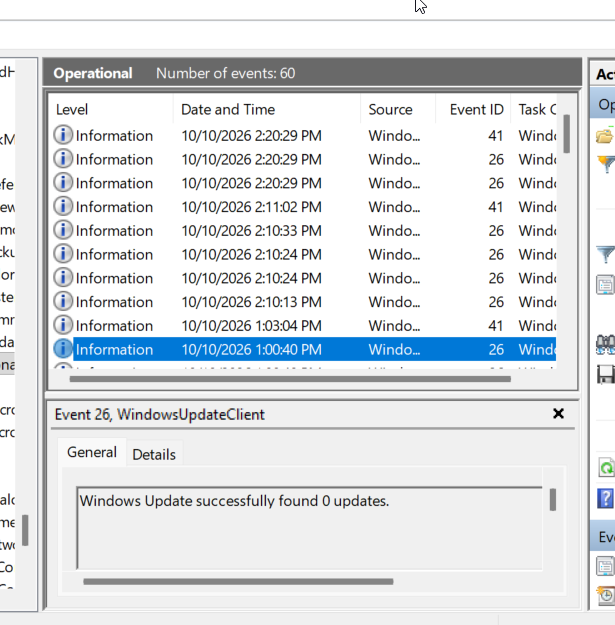  
After pausing, its time to take a snapshot named patched and move on to the next VMs with the snapshot named patched.   
In both Pilot and Prod VMs check the device sync status for no errors:  
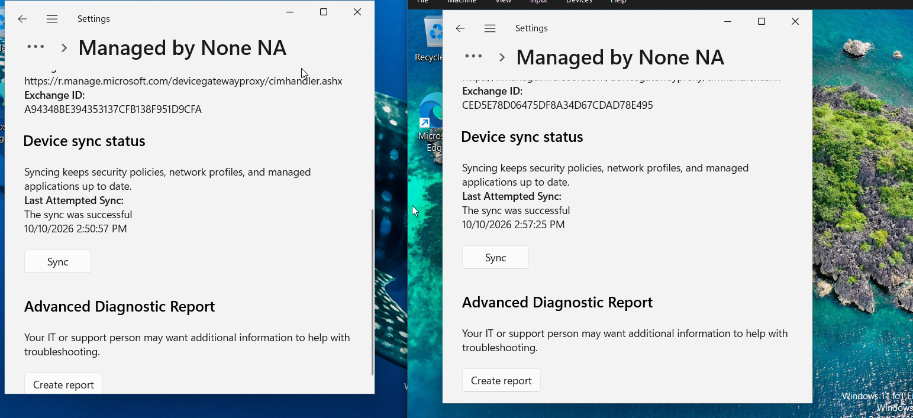  
Lets do the WIN11-TEST first so run to disable new OS update:   
$k = "HKLM:\SOFTWARE\Policies\Microsoft\Windows\WindowsUpdate"  
New-Item $k -Force | Out-Null   
Set-ItemProperty $k TargetReleaseVersion 1 -Type DWord  
Set-ItemProperty $k ProductVersion "Windows 11" -Type String    
Set-ItemProperty $k TargetReleaseVersionInfo "24H2" -Type String    
Restart-Service wuauserv    
Then run on WIN11-PILOT:    
$k = "HKLM:\SOFTWARE\Policies\Microsoft\Windows\WindowsUpdate"  
New-Item "$k\AU" -Force | Out-Null  
Set-ItemProperty $k WUServer "http://deadwsus.lab.local:8530" -Type String  
Set-ItemProperty $k WUStatusServer "http://deadwsus.lab.local:8530" -Type String    
Set-ItemProperty "$k\AU" UseWUServer 1 -Type DWord  
Restart-Service wuauserv    
And if after clicking Resume updates it shows updates and starts downloading, run Restart-Service wuauserv and a couple to see this:    
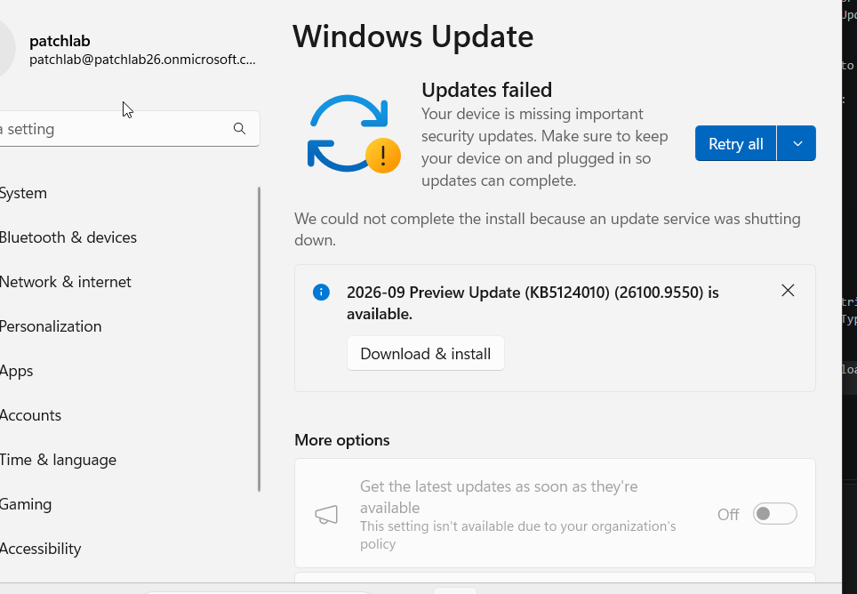    
To investigate more open up admin PowerShell and run:   
$s = New-Object -ComObject Microsoft.Update.Session 
$s.CreateUpdateSearcher().Search("IsInstalled=0")   
Which should output:    
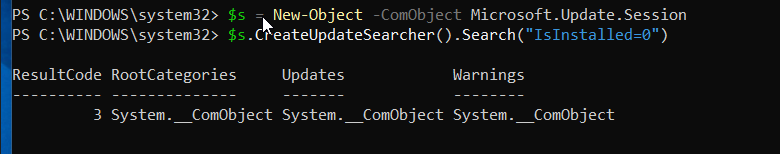    
Result 3 means no clean failure so run this to get more:    
$r = $s.CreateUpdateSearcher().Search("IsInstalled=0")  
$r.ResultCode   
$r.Updates.Count    
$r.Warnings | ForEach-Object { $_.Message; $_.HResult } 
With the output:    
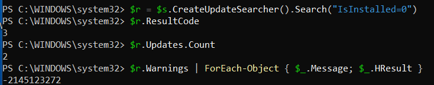   
3 means partial success and the warning of the negative one so run this to get another picture: 
'{0:X}' -f -2145123272  
$r.Updates | ForEach-Object { $_.Title }    
And output: 
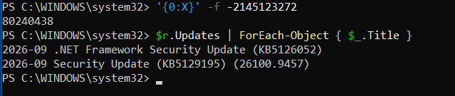  
The hex value, when looking it up, says that this is a network connectivity issue despite finding updates. Hex value can also be found in Event Viewer as well within the WindowsUpdateClient:  
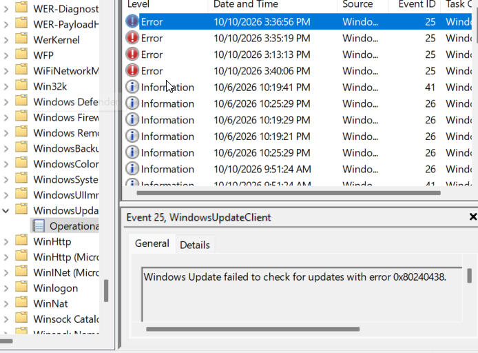    

